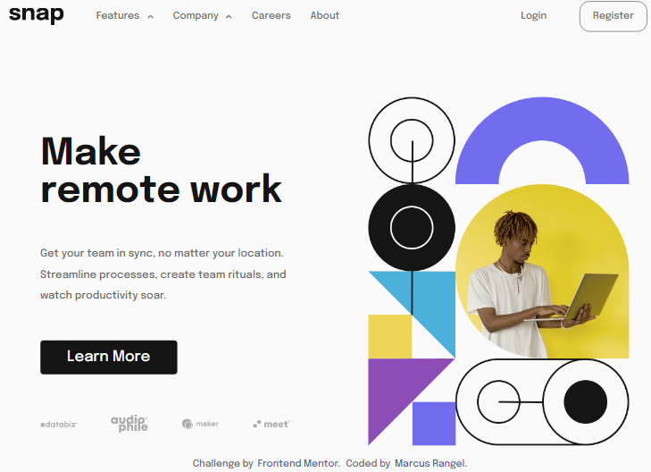

# Frontend Mentor - Intro section with dropdown navigation solution

This is a solution to the [Intro section with dropdown navigation challenge on Frontend Mentor](https://www.frontendmentor.io/challenges/intro-section-with-dropdown-navigation-ryaPetHE5). Frontend Mentor challenges help you improve your coding skills by building realistic projects.

## Table of contents

- [Overview](#overview)
  - [The challenge](#the-challenge)
  - [Screenshot](#screenshot)
  - [Links](#links)
- [My process](#my-process)
  - [Built with](#built-with)
  - [Useful resources](#useful-resources)
- [Author](#author)
- [Acknowledgments](#acknowledgments)

## Overview

### The challenge

Users should be able to:

- View the relevant dropdown menus on desktop and mobile when interacting with the navigation links
- View the optimal layout for the content depending on their device's screen size
- See hover states for all interactive elements on the page

### Screenshot

### Links

- Solution URL: [This very repo](https://your-solution-url.com)
- Live Site URL: [Hosted by Netlify](https://dropdownfementor.netlify.app/)

## My process

### Built with

- Semantic HTML5 markup
- CSS custom properties
- Flexbox
- Mobile-first workflow

### Useful resources

- [Dilshan Kelsen](https://dilshankelsen.com/style-arrow-of-html-accordion/)
- [How to position <detail> marker to come after 
](https://stackoverflow.com/questions/56758098/how-to-position-detail-marker-to-come-after-summary)
  - These two articles helped me to customize the markers of `
` tag.

## Author

- Frontend Mentor - [@WebDevCampos](https://www.frontendmentor.io/profile/WebDevCampos)
- Github - [Marcus Rangel](https://github.com/WebDevCampos)
- Linkedin - [Marcus Rangel](https://www.linkedin.com/in/marcus-rangel-webdev/)
- Codepen - [@webdevcampos](https://codepen.io/webdevcampos)
- Discord - [Ghostdancing#3983](https://discord.com/)
