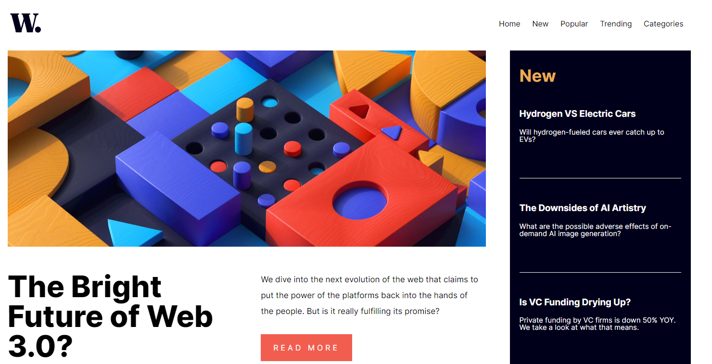

# Frontend Mentor - News homepage solution

This is a solution to the [News homepage challenge on Frontend Mentor](https://www.frontendmentor.io/challenges/news-homepage-H6SWTa1MFl). Frontend Mentor challenges help you improve your coding skills by building realistic projects.

## Table of contents

- [Overview](#overview)
  - [The challenge](#the-challenge)
  - [Screenshot](#screenshot)
  - [Links](#links)
- [My process](#my-process)
  - [Built with](#built-with)
  - [What I learned](#what-i-learned)
- [Author](#author)

## Overview

### The challenge

Users should be able to:

- View the optimal layout for the interface depending on their device's screen size
- See hover and focus states for all interactive elements on the page
- **Bonus**: Toggle the mobile menu (requires some JavaScript) **(TO BE DONE)**

### Screenshot

### Links

- Solution URL: [This very repo](https://github.com/WebDevCampos/FrontEndMentor/tree/main/news_FEMENTOR)
- Live Site URL: [Hosted by Netlify](https://newsfementor.netlify.app/)

## My process

### Built with

- Semantic HTML5 markup
- CSS custom properties
- Flexbox
- CSS Grid
- Mobile-first workflow

### What I learned

Hello!
This one was (still is) challenging indeed!
I had (still have) been struggling with CSS Grid concepts.
I am so tired from this one, that even the JS part is just functional, not elegant, not printable at all 😂!

I WILL improve the code for the next days, and I really appreciate reviews and feedbacks from you guys! Thanks in advance!!

## Author

- Frontend Mentor - [@WebDevCampos](https://www.frontendmentor.io/profile/WebDevCampos)
- Github - [Marcus Rangel](https://github.com/WebDevCampos)
- Linkedin - [Marcus Rangel](https://www.linkedin.com/in/marcus-rangel-webdev/)
