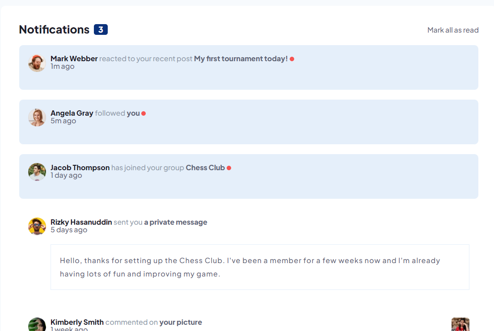

# Frontend Mentor - Notifications page solution

This is a solution to the [Notifications page challenge on Frontend Mentor](https://www.frontendmentor.io/challenges/notifications-page-DqK5QAmKbC). Frontend Mentor challenges help you improve your coding skills by building realistic projects.

## Table of contents

- [Overview](#overview)
  - [The challenge](#the-challenge)
  - [Screenshot](#screenshot)
  - [Links](#links)
- [My process](#my-process)
  - [Built with](#built-with)
  - [What I learned](#what-i-learned)
  - [Continued development](#continued-development)
  - [Useful resources](#useful-resources)
- [Author](#author)
- [Acknowledgments](#acknowledgments)

## Overview

### The challenge

Users should be able to:

- Distinguish between "unread" and "read" notifications
- Select "Mark all as read" to toggle the visual state of the unread notifications and set the number of unread messages to zero
- View the optimal layout for the interface depending on their device's screen size
- See hover and focus states for all interactive elements on the page

### Screenshot

### Links

- Solution URL: [This Very Repo](https://github.com/WebDevCampos/FrontEndMentor/tree/main/notifications-FEMENTOR)
- Live Site URL: [Add live site URL here](https://your-live-site-url.com)

## My process

### Built with

- Semantic HTML5 markup
- CSS custom properties
- Flexbox
- Mobile-first workflow

### What I learned

It was difficult to settle a pattern: grid or flexbox. I ended up with flexbox for the cards components, since they aren't elements that needed quite a separate layout, just alignment. I took a peek at several member's from [Front End Mentor](https://www.frontendmentor.io/) jobs, specially [@vcarames](https://www.frontendmentor.io/profile/vcarames), who has an amazing workflow.
I learned (I think I did) how to use the clamp() CSS function, to adjust the main element's width. I know clamp() function is used often along with typography, which I'll do, but for now, I just want to upload this job.

## Author

- Frontend Mentor - [@WebDevCampos](https://www.frontendmentor.io/profile/WebDevCampos)
- Github - [Marcus Rangel](https://github.com/WebDevCampos)
- Linkedin - [Marcus Rangel](https://www.linkedin.com/in/marcus-rangel-webdev/)

## Acknowledgments

Thanks again to [@vcarames](https://www.frontendmentor.io/profile/vcarames), [@Cheosphere](https://www.frontendmentor.io/profile/Cheosphere), [@AdrianoEscarabote](https://www.frontendmentor.io/profile/AdrianoEscarabote) and many others from the community.
